## 获得数据
数据为以用户"阿尔卑斯君"为中心向外bfs搜索得到。

执行src下的gen.sh,在data下生成user.txt,star.txt,relation.txt三个文件。

执行src下的build.py,在data下生成graphAll.xml.gz这个基于graphtools的数据文件。

### user.txt
64452条用户信息，包括：
用户编号，用户编号2(暂时不用)，昵称，性别，个性签名
以制表符分割
例:
```
1000005991	1005051000005991	衷柏夷	他	活在当下,且行且珍惜	福建
1000124571	1005051000124571	工信布	他	互联网科技、经济、生活与宽窄新锐哲思。出版有《互联网时代的浪漫与痛痒——传统行业转型之道》、《嬗变》、《宏声传播集》等。	四川
1000241231	1005051000241231	翡翠羽裳	她	发现近在咫尺的美广东
1000463683	1005051000463683	Ann宝贝琴	她	有一种爱，是信念，从未向时间屈服。	江苏
1000585644	1005051000585644	知心老王	他	心情好，才是真的好！	北京
1000655734	1005051000655734	苏伊finjamie	他		江苏
1000726952	1005051000726952	张毅伟yy	他	上海交通大学EMBA校友会副主席领导力及企业策划专家致力于德鲁克管理的传播	上海
1000830690	1005051000830690	-金浩翔	他		浙江
1000891302	1005051000891302	杨越VJ	他	SMG魅力音乐电视频道总监，VJ，有事电邮yangyue3003@hotmail.com	上海
1001121254	1005051001121254	Rainboy2018	他		北京
```

### star.txt
6339630条点赞关系，包括：
点赞用户编号，被点赞用户编号，点赞时间
以制表符分割，时间格式为YYYY-MM-DD HH:MM:SS
例:
```
1000005991	1065618283	2016-07-12 17:16:47
1000005991	1067942913	2015-09-06 21:35:39
1000005991	1101519144	2014-08-30 23:14:13
1000005991	1180514263	2015-06-11 15:05:19
1000005991	1187900115	2014-06-12 19:14:10
1000005991	1189590121	2015-08-28 23:46:37
1000005991	1191965271	2014-08-17 21:54:44
1000005991	1191965271	2016-02-16 11:13:35
1000005991	1195389671	2015-10-05 16:16:09
1000005991	1198367585	2015-09-23 23:43:51
```

### relatation.txt
34111736条关注关系，包括：
关注者，被关注者
以制表符分割
例:
```
1000005991	1004941280
1000005991	1005592945
1000005991	1007262567
1000005991	1007330514
1000005991	1008927295
1000005991	1008965464
1000005991	1009493500
1000005991	1057805991
1000005991	1062133183
1000005991	1067942913
```

## 数据分析
### 构建原始数据

1. 使用build.py，对user进行去重，对star和relation中含有溢出用户的条目。
2. 以user为节点，star和relation为边，构建一个含有重边的连通有向图。

|||
|-|-|
|user vertex|64422|
|star edge|2570280|
|relation edge|9051246|

### 入度出度分析
算法简单不提，复杂度O(|V|)。
运行draw-degree.py。

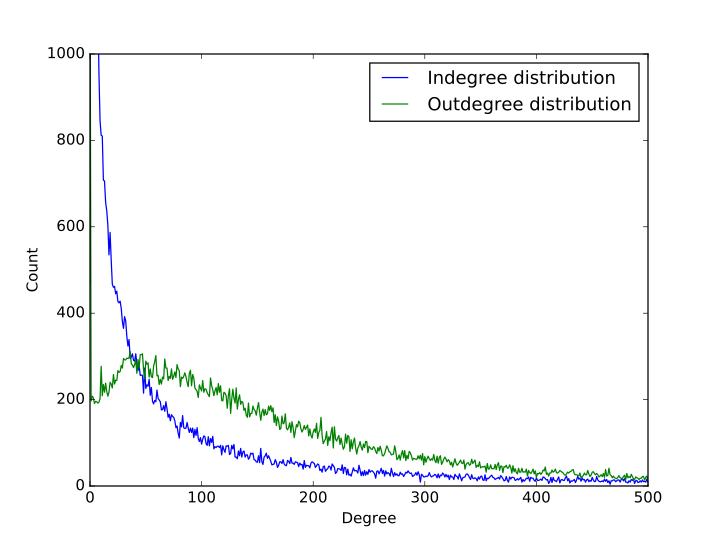

入度的分布与入度的数量大体成反比关系，入度为0的样本不多，有467个，入度为1的样本最多，有7484个，往后则递减，直至入度为37847的有一个。

出度的分布除了出度为0的有1264个之外，其余总体成先上升后下降的过程，在出度为1时，有197个，然后在出度为36时达到极大值311个，接着缓慢下降，直至出度为1947时有1个。

需要注意的是，由于数据源并不是社交网络的全体，而是其中一个连通子图，因此在图的边界会留有很多未来得及遍历的节点，显然他们的出度都为0，因此在出度的分布中才会出现出度为0的特别多的情况。

### 直径分析
算法简单不提，复杂度O(V*V)
运行draw-distance.py。

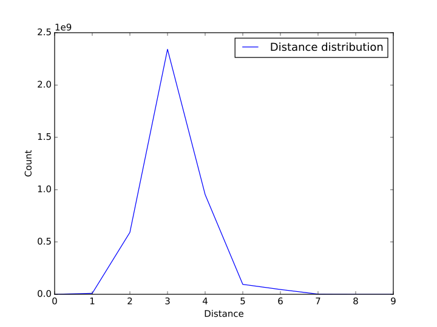
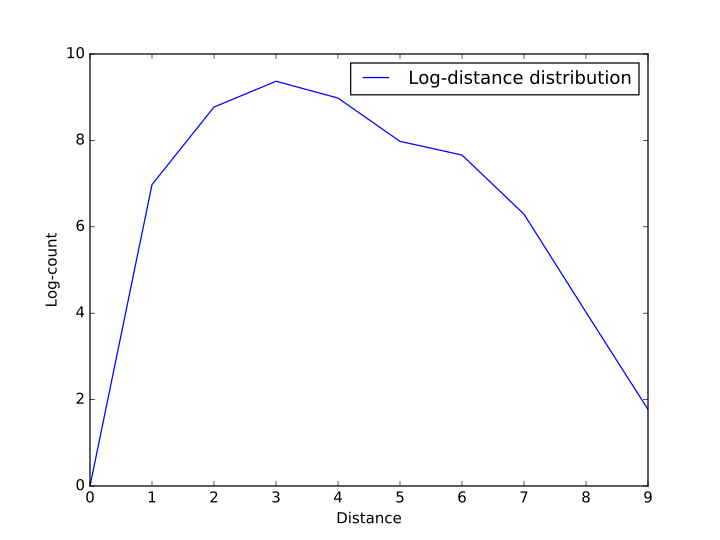

我们统计了数据集中任意两个结点之间最短路的长度，统计之后发现绝大多数的点之间的距离在3以内，分布成先上升后下降的趋势，并且所有的结点之间的距离都不大于9。为了方便演示，我们在图一的基础上对数值取了对数作为图二。

### PageRank分析
算法复杂度约为O(V+E)。
运行draw-pagerank.py。

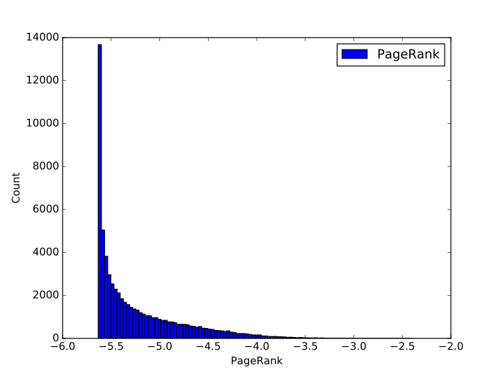

我们根据pagerank算法对节点进行了统计，并将pagerank的值取了对数，将数据范围划分成了100个区块进行直方图统计。统计之后发现pagerank值在1e-5.65左右的节点最多，在这个数值之前的节点数目最多，这主要是受边界节点的影响。随着pagerank的增加，节点的数目近似反比例下降，直至pagerank最大达到1e-2左右。

## 采样分析
### 采样方法
由于对数据进行聚类分析等操作复杂度较高，而且大量的数据不利于数据可视化，我们在接下来的分析中采用数据集的一个样本空间进行分析，采样方法如下:

1. 在所有节点中，随机采样500个节点，得到点集V';
2. 在所有的边中，保留端点均在点集V'中的边，得到边集E;
3. 在点集V'中，删除入度和出度均为0的孤立节点，得到新的点集V;

这样我们就得到了一个子图G=(V,E)，作为我们接下来使用的样本。

### 合理性分析
为了验证我们的样本能代表全集的特点，我们对样本再次进行了”入度出度分析“，“直径分析”以及”pagerank“分析，分析结果图如下:

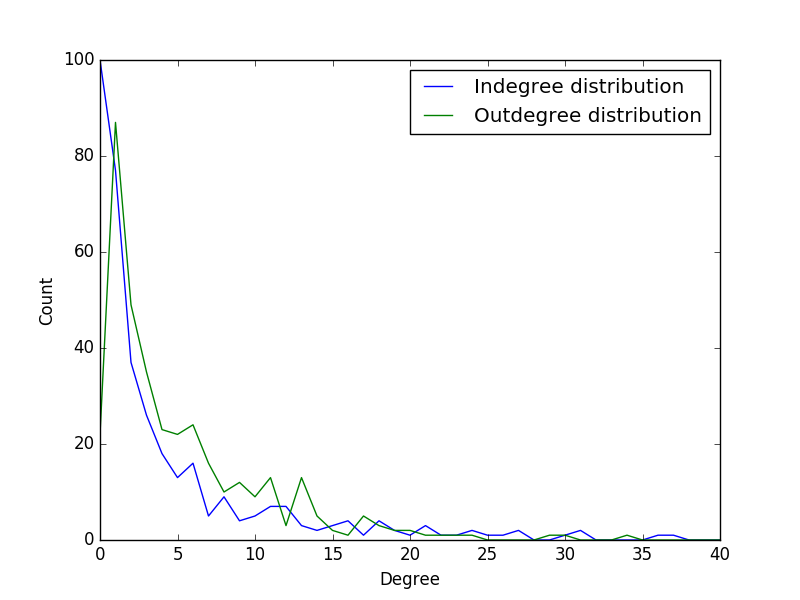
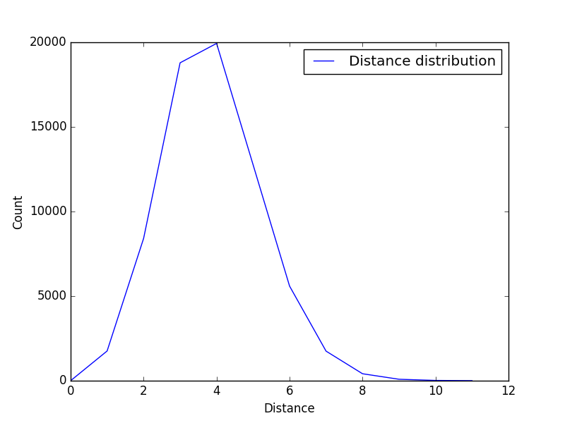
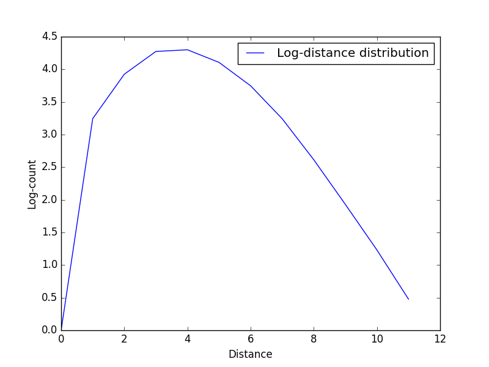
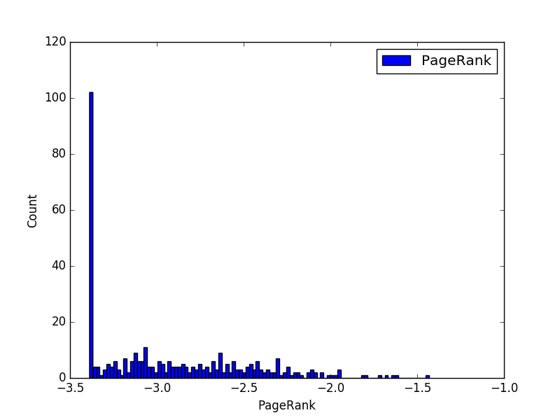

可见总体上我们的样本能较好的体现总体的特征。

### 样本可视化
#### SFDP绘图算法
这是一个复杂度为O(V*logV)的绘图算法。
所谓SFDP，是一种多级受力导向(multilevel force-directed placement)的绘图方式。

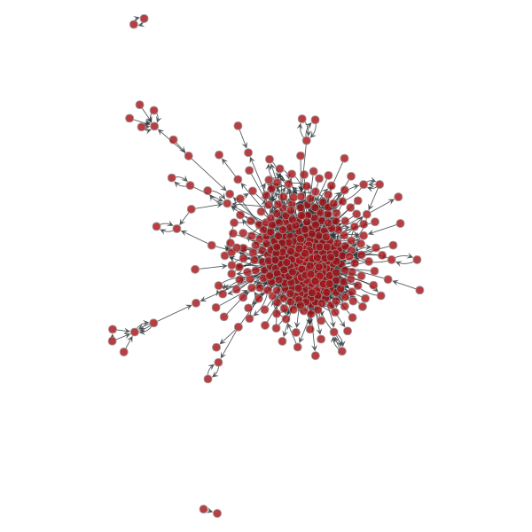

#### 径向布局
这个算法是一个复杂度为O(V+E)的绘图算法。
大概思想是随机选一个中心点，以这个中心点为根生成一个最小生成树，用节点离中心点的距离代表树中离根节点的距离。


#### ARF绘图算法
这个算法是一个复杂度为O(V*V)的绘图算法。
所谓ARF，是指"attractive and repulsive forces"，即“有吸引力和排斥力”，简而言之，就是将边看成是弹簧，边权越大，弹簧越紧，边的长度越短;边权越小，弹簧越送，边的长度越长，这样就可以生成一个较为清楚的图案。

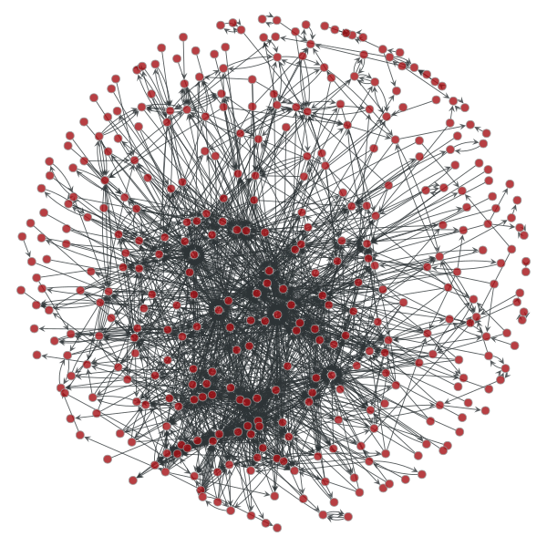


### 分块
分块算法主要基于非参数随机块模型(Nonparametric stochastic block model)。
算法复杂度O(V*lnV*lnV)

#### 随机块模型(　stochastic block model)
我们对随机块模型生成的图中用相同的颜色、相同的图案来表示一个社团。


#### 嵌套随机块模型( nested stochastic block model)
我们对嵌套随机模型采用了霍尔顿分层(Holden hierarchy)进行可视化，相同颜色的图案表示一个社团，有向箭头表示层级关系。

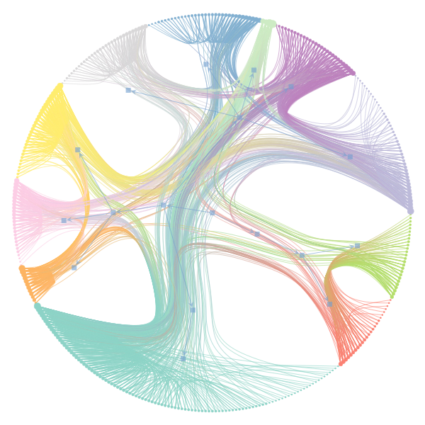

## 参考资料
[wiki pagerank](https://graph-tool.skewed.de/static/doc/centrality.html#graph_tool.centrality.pagerank)

[Graph-tool](https://graph-tool.skewed.de)

[sfdp-layout](http://www.mathematica-journal.com/issue/v10i1/graph_draw.html)

[arf-layout](http://dx.doi.org/10.1142/S0129183107011558)

[浅谈网络数据的可视化技术](http://www.vizinsight.com/2010/12/%E6%B5%85%E8%B0%88%E7%BD%91%E7%BB%9C%E6%95%B0%E6%8D%AE%E7%9A%84%E5%8F%AF%E8%A7%86%E5%8C%96%E6%8A%80%E6%9C%AF%EF%BC%88%E4%B8%8B%EF%BC%89/)

